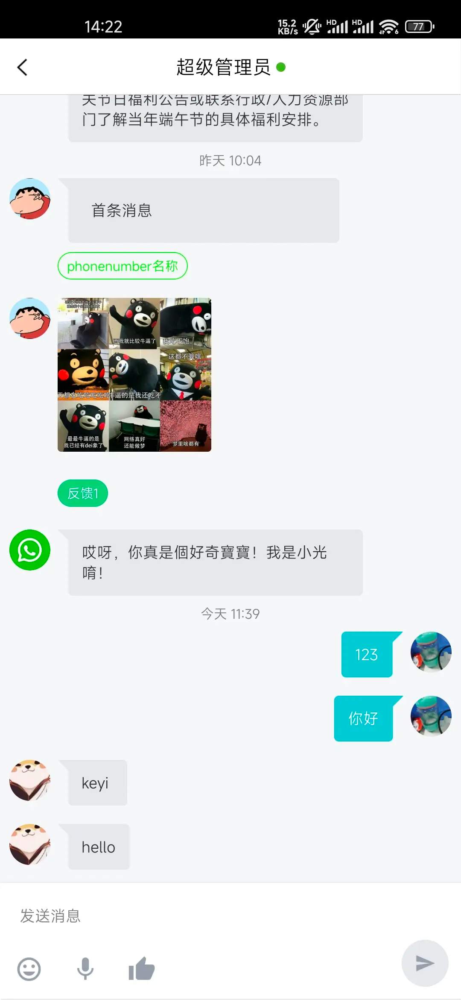

# 移动应用 SDK for Android 开发文档

## ScreenShot


## 集成SDK

### Environment Required
- JDK7+

### AndroidStudio

```
implementation 'com.mixdesk:androidx:0.0.1'
implementation 'com.github.bumptech.glide:glide:4.9.0'
annotationProcessor 'com.github.bumptech.glide:compiler:4.9.0'
```

## 使用

### 1.初始化
``` java
MXConfig.init(this, "Your Appkey", new OnInitCallback() {
    @Override
    public void onSuccess(String clientId) {
        Toast.makeText(MainActivity.this, "init success", Toast.LENGTH_SHORT).show();
    }

    @Override
    public void onFailure(int code, String message) {
        Toast.makeText(MainActivity.this, "int failure", Toast.LENGTH_SHORT).show();
    }
});
```
> 如果您不知道 Appkey ，请使用管理员帐号登录 Mixdesk，在「接入」 -> 「APP SDK」 菜单中查看

### 2.启动对话界面

初始化成功后，就可以直接启动对话界面

> 使用当前 id 分配上线

``` java
Intent intent = new MXIntentBuilder(this).build();
startActivity(intent);
```

## 常见使用场景

> 开发者的 App 有自己的账号系统，希望每个账号对应不同的顾客，有不同的聊天记录。那就需要开发者在启动对话的时候，绑定账号：
``` java
Intent intent = new MXIntentBuilder(this)
        .setCustomizedId("开发者的 id") // 相同的 id 会被识别为同一个顾客：顾客唯一标识为长度6到32的字符串
        .build();
startActivity(intent);
```

> 开发者希望顾客上线的时候，能够上传（或者更新）一些用户的自定义信息：

``` java
HashMap<String, String> clientInfo = new HashMap<>();
clientInfo.put("name", "富坚义博");
clientInfo.put("avatar", "https://s3.cn-north-1.amazonaws.com.cn/pics.meiqia.bucket/1dee88eabfbd7bd4");
clientInfo.put("gender", "男");
clientInfo.put("tel", "1300000000");
clientInfo.put("技能1", "休刊");

HashMap<String, String> updateInfo = new HashMap<>();
updateInfo.put("name", "update name");

Intent intent = new MXIntentBuilder(this)
        .setClientInfo(clientInfo) // 设置顾客信息 PS: 这个接口只会生效一次,如果需要更新顾客信息,需要调用更新接口
//      .updateClientInfo(updateInfo) // 更新顾客信息 PS: 如果客服在工作台更改了顾客信息，更新接口会覆盖之前的内容
        .build();
startActivity(intent);
```

> 设置监听 MXConversationActivity 生命周期的回调接口

``` java
MXConfig.setActivityLifecycleCallback(new MXSimpleActivityLifecycleCallback() {
});
```


## 常见问题列表

- **code == 400 track_id 错误**

   如果需要绑定用户 id，请使用 setCustomizedId 接口；如果还是有问题，就换一个 id 绑定再试试

- **后台改了配置，SDK 不生效**

   SDK 的配置不是立即生效，会至少间隔 15 分钟刷新一次，刷新后下次生效。如果想要立即看到配置改变的效果，可以卸载应用重新安装。

## 全部文档
[查看详情][1]

 [1]: https://mixdesk.com/help/docs/sdk-for-android/